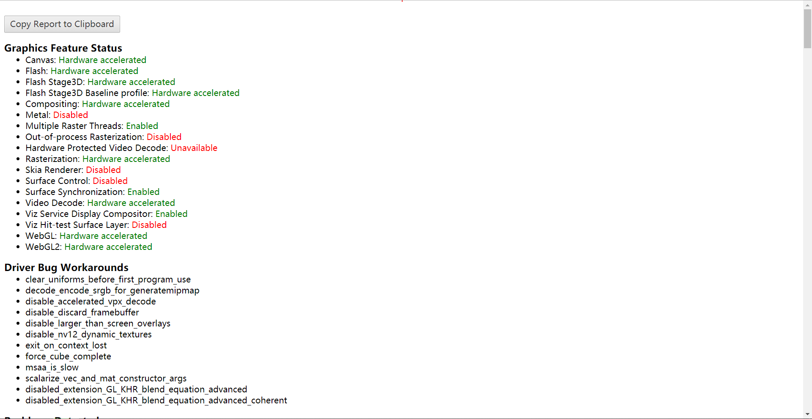
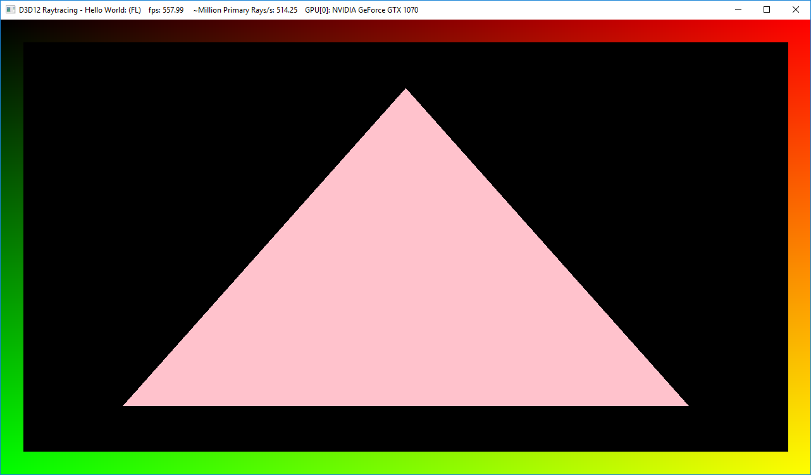
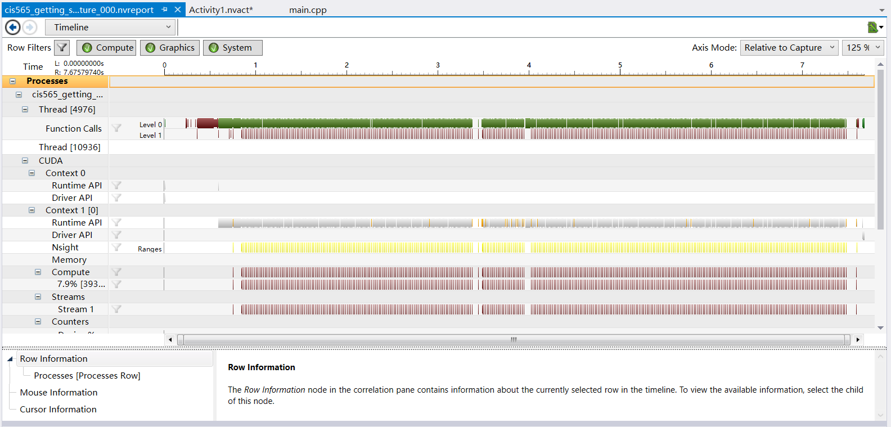
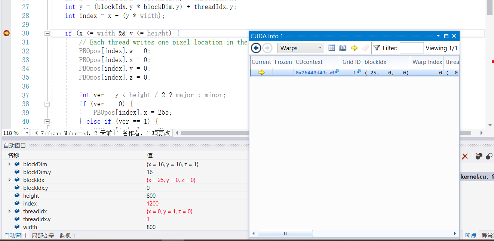

Project 0 Getting Started
====================

**University of Pennsylvania, CIS 565: GPU Programming and Architecture, Project 0**

* Jiangping Xu
  * [LinkedIn](https://www.linkedin.com/in/jiangping-xu-365b19134/)
* Tested on: Windows 10, i7-4700MQ @ 2.40GHz 8GB, GT 755M 6100MB (personal laptop) \\
            For the part 2.3 DXR, I use the SigLab computer instead.

* Part 2.2: WebGL \\
the output of `chrome:\\gpu` \\

* Part2.3: DXR \\
modified triangle \\

* Part 4: Modify \\
test program with my name on the title \\

* Part 5: Analyze \\
Timeline \\

* Part 6: Nsight Debugging \\
*Autos* window and the *CUDA Info* -> *Warp* \\

